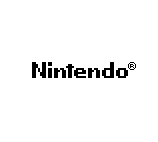
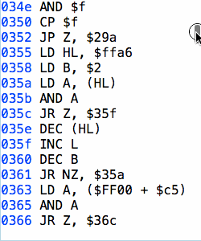
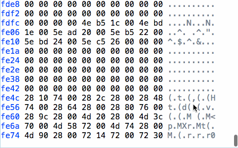

Coffee Boy
==========

A Game Boy emulator for the browser written in CoffeeScript.




Coffee Boy currently includes a complete disassembler and a mostly complete, very accurate, CPU core. Some games run, albeit with tons of glitches - mostly graphical.

### Getting Started

With CoffeeScript installed, run ```cake build``` to see available tasks. `cake server` starts listening at http://localhost:3000. You'll need to find your own bootloader ROM and copy it to `/www/ROMS/DMG_ROM.bin`, your game ROM should be copied to `/www/ROMS/ROM.gb`.

### Disassembler



### Memory Debugger



### Blargg's CPU instruction test ROM

Blargg's test ROMs are a good indicator of an emulator's accuracy [with most emulators failing some tests.](http://gbdev.gg8.se/wiki/articles/Test_ROMs) Coffee Boy's CPU core already performs better than a large majority of emulators.

```
Pass: 01-special
Fail: 02-interrupts
Pass: 03-op sp,hl
Pass: 04-op r,imm
Pass: 05-op rp
Pass: 06-ld r,r
Pass: 07-jr,jp,call,ret,rst
Pass: 08-misc instrs
Pass: 09-op r,r
Pass: 10-bit ops
Pass: 11-op a,(hl)
```
